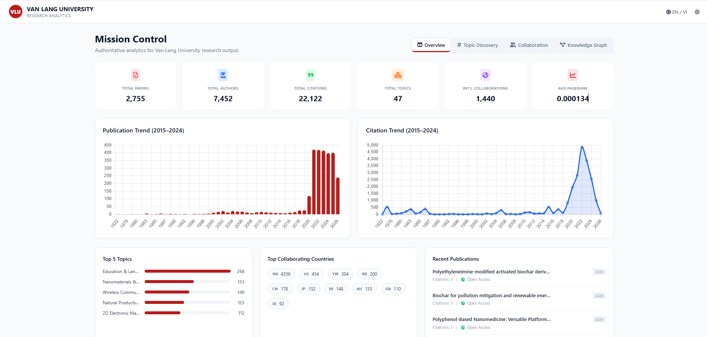
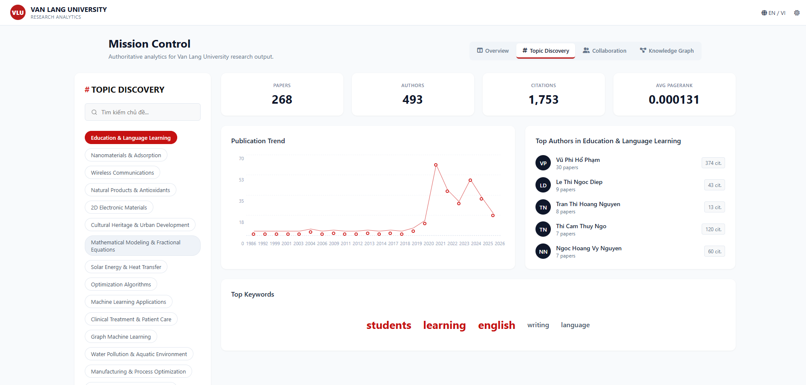
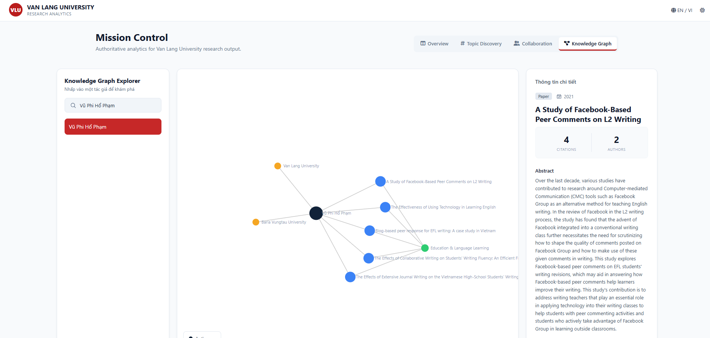

# 📚 Research Analytics System for Scientific Publications at Van Lang University

---

## 📖 Introduction
The Research Analytics System for Scientific Publications at Van Lang University is a web-based platform for collecting, analyzing, and visualizing scientific publication data from OpenAlex. The system provides interactive dashboards for publication statistics, topic discovery, collaboration network analysis, and knowledge graph visualization.
This project was developed to support the management and analysis of scientific publication activities at Van Lang University.

---

## ✨ Features
- Research dashboard
- Topic discovery 
- Collaboration network analysis 
- Knowledge graph

---

## ⚙️ Installation
Clone the repository and install the required dependencies.

```bash
git clone https://github.com/your-username/research-analytics.git

cd vanlang_analysis_01

pip install -r requirements.txt
```

--- 

## 🐳 Run with Docker
Build and run the application using Docker Compose.

```bash
docker compose up --build
```

--- 

## 🚀 Usage
After starting the application, open the following pages in your browser:
- **Dashboard**
http://localhost:5001/
- **Topic Discovery**
http://localhost:5001/topic_discovery/
- **Collaboration Network**
http://localhost:5001/collaboration/
- **Knowledge Graph**
http://localhost:5001/knowledge_graph/

---

## 📸 Demo

### Dashboard
<p align="center">
  
</p>

---

### Topic discovery 
<p align="center">
  
</p>

---

### Collaboration Network
<p align="center">
  
</p>

---

### Knowledge Graph
<p align="center">
  
</p>

---

## 🛠️ Technology Stack

### Backend 
- Python 
- Flask 

### Database 
- PostgreSQL 

### Machine learning 
- Bertopic 
- Sentence Transformers
- UMAP 
- HDBSCAN 

### Data analysis 
- Pandas 
- Numpy 
- NetworkX 

### Visualization 
- Matplotlib 
- Seaborn 
- Plotly 

---

### 🐳 Deployment
- Docker
- Docker Compose 

---

## 📄 License
This project is developed for academic and educational purposes only. Unauthorized commercial use, reproduction, or redistribution of this project is not permitted without the author's permission. dịch cho mình đoạn này đi

---

## 👨‍💻 Author
**Le Phuong Truc**
- Email: lptruc1310@gmail.com
- Github: https://github.com/LePhuongTruc13
- Linkedin: linkedin.com/in/trúc-lê-8a8102361